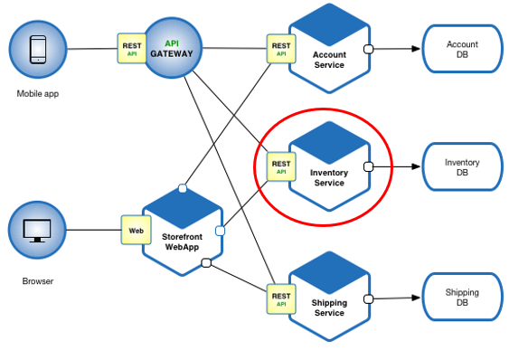

Spring-boot application with a REST controller, which expose a Swagger API catalog

The following is a job qualification exercise which uses following technologies:

- Java
- Spring boot 
- Swagger 
- REST API/JSON
- Docker 

The application expose the following APIs:

-List of the inventory items list (item no, name, amount, inventory code)      

-Read item details (by item no)       

-Withdrawal quantity of a specific item from stock             

-Deposit quantity of a specific item to stock			                                 

-Add item to stock						                                                     

-Delete an item from stock

Data persisted on H2 DB using JPA. The application pack and run from docker.

You can go to swagger-ui and see the API.
In the future i thinking to create Angular pages for the fron-end which enable to create/read/update and delete the items in the inventory,  meanwhile you can use Postman to see the resposes and the inventory.

You can find the docker imarg here:
https://hub.docker.com/r/iitzhakk/spring-inventory

As you can see this microservice can be a part of a more complex e-commerce application.

Image by https://microservices.io

